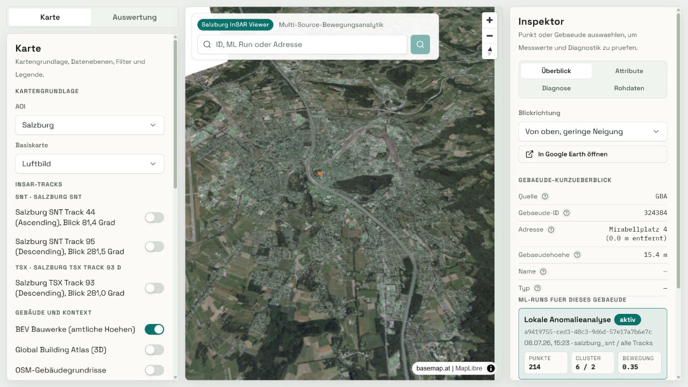
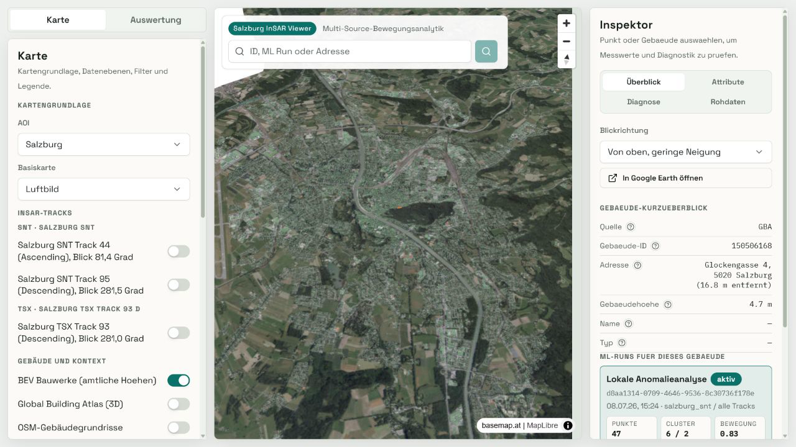
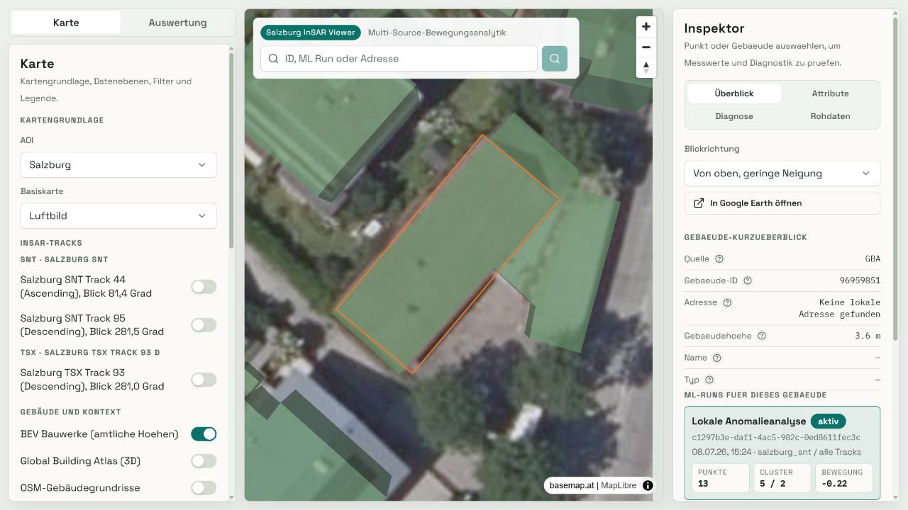
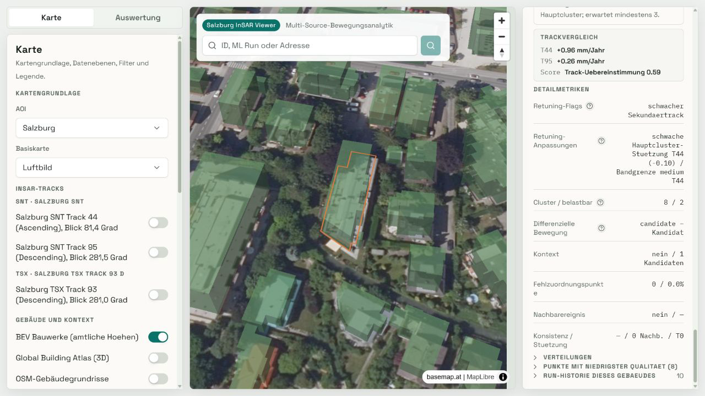
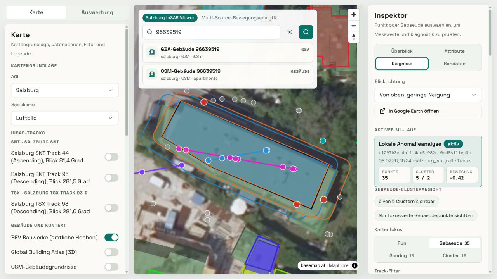
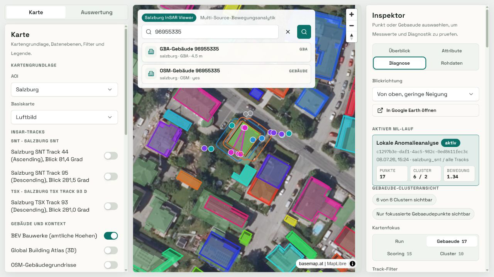
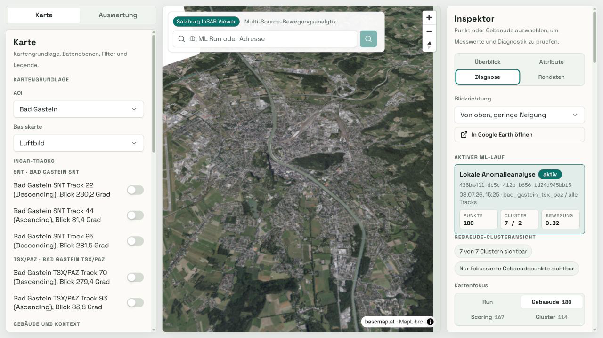
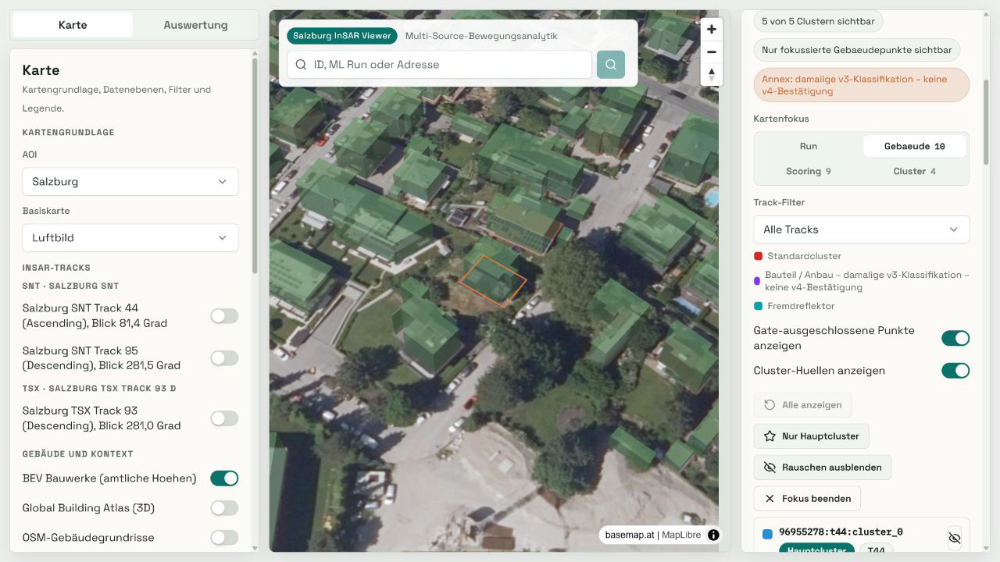

# Phase 8 v4 RC – visueller Audit

**Geprüft am:** 2026-07-10

**Entscheidung:** **ROT – v4 RC geprüft, nicht akzeptiert**

## Zweck und Evidenzgrenzen

Der Audit verbindet die im Browser sichtbaren Gebäude-/Clusteransichten mit den
persistierten v4-Rollups aus
[`phase8_v4_rc_watch_items_survivors.json`](phase8_v4_rc_watch_items_survivors.json).
Die Screenshots belegen die UI-Darstellung und eine geometrische Plausibilitätsprüfung;
sie ersetzen keine unabhängige geodätische Ground Truth. Die Zuordnung zu
`standard`, `annex` und `foreign` sowie Level und Evidenzwerte stammen aus dem
persistierten Maschinenartefakt.

Ergebniskategorien:

- **bestätigt:** Darstellung und persistierte Semantik entsprechen dem erwarteten Fall.
- **korrigiert:** Der Audit führte zu einer korrigierten fachlichen Einordnung.
- **bewusst toleriert:** technisch konsistent, aber ohne ausreichend starke unabhängige visuelle Bestätigung.
- **unklar:** Akzeptanzkriterium ist nicht belegt; der Fall bleibt ein RC-Blocker.

## Ergebnisübersicht

| Fall | Geometrische Plausibilität | `cluster_kind` | Differential-Level / Evidenz | Ergebnis |
|---|---|---|---|---|
| Mirabell, Gebäude `324384`, Run `a9419755-...` | Gebäudeübersicht plausibel; `214` Punkte, `6` Cluster, davon `2` zuverlässig | Übersichtsanker; Einzeltypen nicht separat auditiert | keine auffällige Differential-Evidenz; Bewegung `0,35 mm/a`, Reliability `0,90` (`high`), Status `ok` | **bestätigt** |
| Osthang, Gebäude `150506168`, Run `d8aa1314-...` | Gebäudeübersicht plausibel; `47` Punkte, `6` Cluster, davon `2` zuverlässig | Übersichtsanker; Einzeltypen nicht separat auditiert | keine auffällige Differential-Evidenz; Bewegung `0,83 mm/a`, Reliability `0,88` (`high`), Status `ok` | **bestätigt** |
| Moosstraße `96959851`, Track 95 | Gebäudefläche und separierter Anbau sind plausibel; der kleine Evidenzcluster bleibt wegen `n=2` nur eingeschränkt belastbar | Evidenz aus `annex_0`; ein Track-44-`foreign` bleibt korrekt `weak_support` und ist weder Main noch Evidenzquelle | `candidate`, `delta=-1,98 mm/a`, `sigma=0,916`, Downgrade `small_n_guard` | **bestätigt** |
| Moosstraße `96637447`, Track 44 | Screenshot zeigt nur die Gebäude-/Run-Übersicht, nicht die zwei Annex-Punkte in prüfbarer Nahansicht; keine neue visuelle Evidenz für einen Differentialfall | Evidenz aus `annex_0`; sieben `foreign`-Punkte bleiben korrekt `weak_support` und sind weder Main noch Evidenzquelle | unerwartet weiterhin `candidate`, `delta=+2,69 mm/a`, `sigma=1,686`, kein Downgrade | **unklar – rotes Gate** |
| Moosstraße `96639519`, Track 44 | Nahansicht zeigt die räumliche Trennung der Punktgruppen am Gebäude plausibel | Evidenz aus `annex_0`; der einzelne `foreign`-Punkt bleibt korrekt `weak_support` und getrennt | `candidate`, `delta=-2,18 mm/a`, `sigma=1,386`, kein Downgrade | **bestätigt** |
| Moosstraße `96955335`, Track 95 | lokalisierte Punktgruppen sind sichtbar; die kleine 3-Punkt-Annexgruppe hat jedoch keine unabhängige visuelle Bewegungsbestätigung | Evidenz aus `annex_0`; `foreign`-Punkte beider Tracks und `annex_weak` bleiben `weak_support` | `significant`, `delta=-3,96 mm/a`, `sigma=1,244`, kein bestätigender Track | **bewusst toleriert** |
| Bad Gastein `238100082`, SNT Tracks 44/95 | SNT-Fall ist im Maschinenartefakt semantisch sauber, wurde aber nicht als eigene Nahansicht festgehalten | ein `foreign`- und ein `annex_weak`-Punkt, beide `weak_support` | `none`, keine Differential-Evidenz | **bestätigt** |
| Bad Gastein `238100082`, TSX/PAZ Track 70 | Run-/Gebäudeübersicht sichtbar; die vier Annexpunkte sind in diesem Screenshot nicht nah genug für eine unabhängige geometrische Bestätigung | Evidenz aus `annex_0`; neun `foreign`-Punkte bleiben korrekt `weak_support` | `candidate`, `delta=+1,53 mm/a`, `sigma=1,55`, knapp über dem Schwellwert `1,5` | **bewusst toleriert** |
| Historischer v3-Run `79dd1468-...`, Gebäude `96955278` | Historischer Gebäude-/Clusterfokus wird stabil dargestellt; dies ist ein UI-Kompatibilitätsbeleg, keine v4-Geometriebestätigung | Historischer Annex wird sichtbar als „damalige v3-Klassifikation – keine v4-Bestätigung“ markiert; Legende trennt Standardcluster, historischen Anbau und Fremdreflektor | für die v4-RC-Fachentscheidung nicht als neue Differential-Evidenz gewertet | **bestätigt** |

Es gab in diesem Audit keine als **korrigiert** eingestufte Beobachtung. Die
technische `cluster_kind`-Hygiene ist für alle fünf aktiven Differentialfälle
bestätigt: kein `foreign`-/`foreign_suspect`-Cluster ist Evidenzquelle oder Main,
und alle `foreign`-Cluster haben die Rolle `weak_support`.

## Rotes Akzeptanz-Gate

Gebäude `96637447` verletzt das RC-Akzeptanzkriterium: Der persistierte v4-Fall
bleibt ohne neue, in einer Nahansicht prüfbare visuelle Evidenz ein
`candidate` (`+2,69 mm/a`). Der Audit korrigiert diesen Befund nicht stillschweigend
zu `none`, sondern stuft ihn als **unklar** ein. Damit ist die RC-Gesamtentscheidung
ROT: **v4 RC geprüft, nicht akzeptiert**.

Der nachgelagerte 10-AOI-No-op ergänzt einen zweiten, nicht visuellen roten
P0-Befund: `roof_lost=1` für `NSVF80S01`, Track 95, Referenzgebäude `96637447`
in `moosstrasse_bev` (`state=excluded`). Dieser R9-Quellenkonflikt ist im
[`phase8_v4_rc_gate_results.md`](phase8_v4_rc_gate_results.md) vollständig
dokumentiert und wird nicht als stillschweigende Ausnahme behandelt.

Diese fachliche RC-Entscheidung ist laut Supervisor-Vorgabe kein Push-Blocker;
sie muss beim Push jedoch ausdrücklich mitgeführt werden.

## Historische UI-Semantik

Der historische v3-Run `79dd1468-f8ed-42c5-a6bd-62431be06f8f` für Gebäude
`96955278` wird im Inspector und in der Legende nicht nachträglich als v4-Befund
umgedeutet. Der sichtbare Text „Bauteil / Anbau – damalige v3-Klassifikation –
keine v4-Bestätigung“ trennt historische Persistenz von aktueller Semantik. Dieses
UI-Kompatibilitäts-Gate ist **grün**.

## Screenshots

### Plausibilitätsanker

### Watch Items

### Historische Kompatibilität

## Nachverfolgung

Vor einer RC-Akzeptanz ist für `96637447` mindestens eine fokussierte Nahansicht
mit sichtbaren `annex_0`-Punkten und Gebäudekontur sowie eine fachliche Entscheidung
erforderlich, ob die Reach-/Höhen-Evidenz einen realen Bauteilfall darstellt oder
das Level auf `none` begrenzt werden muss. Danach sind Smoke, No-op und visueller
Audit gemeinsam erneut als RC-Gate auszuwerten. Zusätzlich muss das
GBA-/BEV-Referenzgrading für `NSVF80S01` quellenspezifisch geklärt und der
Roof-Retention-Gate erneut ausgeführt werden.
